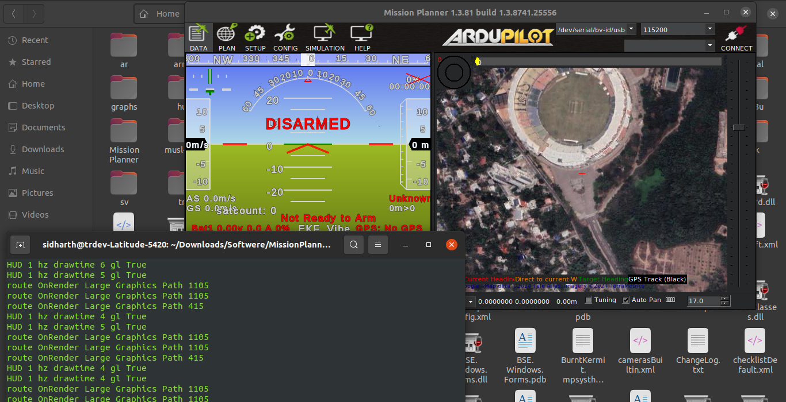

# Mission-Planner-Installation-using-Mono
This guide provides step-by-step instructions for installing Mission Planner on Ubuntu 20.04 using Mono.

Reference: [Ardupilot.org](https://ardupilot.org/planner/docs/mission-planner-installation.html)

## Mission Planner Installation
### Step 1: Install Mono

For Ubuntu 20.04 (amd64, armhf, arm64, ppc64el) you can follow these steps. For all other installations and additional references, visit [mono-project.com](https://www.mono-project.com/download/stable/#download-lin)

#### a. Add the Mono repository to your system
```bash
sudo apt install ca-certificates gnupg

sudo gpg --homedir /tmp --no-default-keyring --keyring /usr/share/keyrings/mono-official-archive-keyring.gpg --keyserver hkp://keyserver.ubuntu.com:80 --recv-keys 3FA7E0328081BFF6A14DA29AA6A19B38D3D831EF

echo "deb [signed-by=/usr/share/keyrings/mono-official-archive-keyring.gpg] https://download.mono-project.com/repo/ubuntu stable-focal main" | sudo tee /etc/apt/sources.list.d/mono-official-stable.list

sudo apt update
```
#### b. Install Mono
```bash
sudo apt install mono-devel
```
Ensure that the mono-devel package is installed to compile code.

### Step 2: Download and Install Mission Planner

There are two options for installation.

#### Option 1:

```bash
mkdir ~/missionplanner

cd ~/missionplanner

wget https://firmware.ardupilot.org/Tools/MissionPlanner/MissionPlanner-latest.zip

unzip MissionPlanner-latest.zip

mono MissionPlanner.exe
```
Mission Planner should now be running.

#### Option 2:

Download Mission Planner as a zip file from [here](https://firmware.ardupilot.org/Tools/MissionPlanner/MissionPlanner-latest.zip) and unzip to a directory.

Go to that directory where MissionPlanner extracted and open the terminal from the same directory. Then, execute:

```bash
mono MissionPlanner.exe
```
Mission Planner should now be running.




## Troubleshooting

### Permission Denied When Connecting to Telemetry

If you encounter a "Permission Denied" error when connecting to telemetry, follow these steps:

1. **Add User to Dialout Group**
   ```sh
   sudo usermod -aG dialout $USER
   ```
    Log out and log back in for the changes to take effect.

2. ***Set Device Permissions***

    ```sh
    sudo chmod 666 /dev/ttyUSB0
    ```
    Replace `/dev/ttyUSB0` with the appropriate device path.

3. ***Run Mono as Superuser***

    If the above steps do not resolve the issue, try running Mono as a superuser:

    ```sh
    sudo mono MissionPlanner.exe
    ```
 4. ***Create Persistent Udev Rules***
 
    For a more permanent solution, create a udev rule:

    ```sh
    echo 'SUBSYSTEM=="tty", ATTRS{idVendor}=="[vendor_id]", ATTRS{idProduct}=="[product_id]", MODE="0666"' | sudo tee /etc/udev/rules.d/99-telemetry.rules
    
    sudo udevadm control --reload-rules
    
    sudo udevadm trigger
    ```
    Replace `[vendor_id]` and `[product_id]` with the correct IDs for your telemetry device.

## Contributing

Pull requests are welcome. For major changes, please open an issue first
to discuss what you would like to change.

Please make sure to update tests as appropriate.

## License

[MIT](https://choosealicense.com/licenses/mit/)
